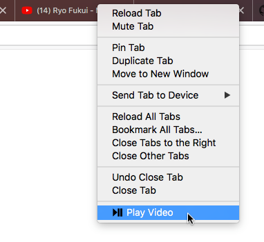

# context-play-pause

WebExtension: Play and pause videos from a tabs context menu

Compatible with Firefox 60.0+ (requires menus.onShown among other events)

I ocassionally listen to music in tab through YouTube.  I became frustrated with having to switch to the back to YouTube's tab to pause the video so I created this extension.  This adds the ability to play and pause html5 videos by opening up a context menu on a tab.

## License

This project is licensed under the GPL-3.0 License - see the [LICENSE](LICENSE) file for details
